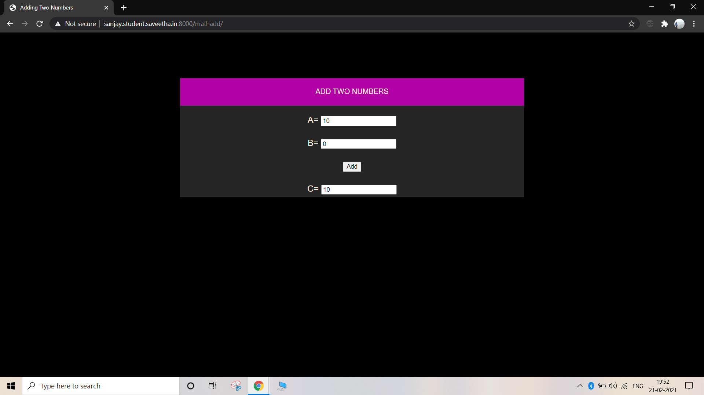
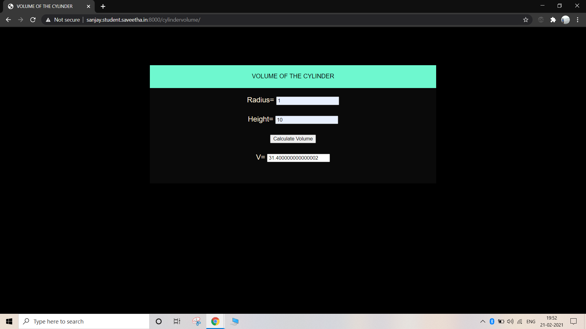
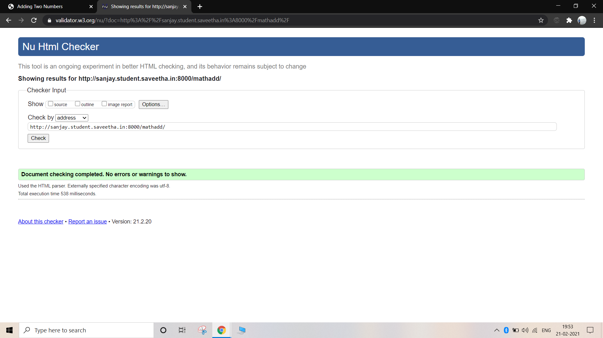
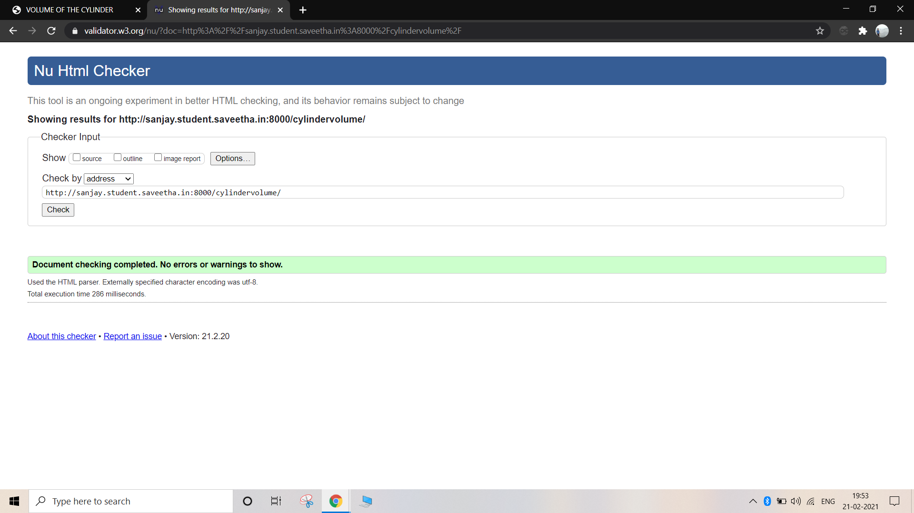

# Mathematical Calculations using JavaScript
## AIM:
To design a website to calculate the area of a circle and volume of a cylinder using JavaScript.

## DESIGN STEPS:
### Step 1: 
Requirement collection.
### Step 2:
Creating the layout using HTML and CSS.
### Step 3:
Write JavaScript to perform calculations.
### Step 4:
Choose the appropriate style and color scheme.
### Step 5:
Validate the layout in various browsers.
### Step 6:
Validate the HTML code.
### Step 6:
Publish the website in the given URL.


## PROGRAM:

## ADDING TWO NUMBERS 

### HTML CODE:
```

<!DOCTYPE html>
<html lang=en>

<head>
    <title>Adding Two Numbers</title>
    <link rel="stylesheet" href="">
</head>

<body>
    <div class="container">
        <div class="formview">
            <div class="banner">
                ADD TWO NUMBERS
            </div>
            <div class="content">
                <form action="/mathadd/" method="GET">
                    
                    <div class="forminput">
                        <label for="value_a">A=</label>
                        <input type="text" name="value_a" id="value_a">
                    </div>
                    <div class="forminput">
                        <label for="value_b">B=</label>
                        <input type="text" name="value_b" id="value_b">
                    </div>
                    <div class="forminput">
                        <button type="button" name="button_add" id="button_add">Add</button>
                    </div>
                    <div class="forminput">
                        <label for="value_c">C=</label>
                        <input type="text" name="value_c" id="value_c" readonly>
                    </div>
                </form>
            </div>
        </div>
    </div>
    <script src="/static/js/mathscript.js"></script>
</body>

</html>

```

## CSS CODE:

```

*{
      box-sizing: border-box;
      font-family: Arial, Helvetica, sans-serif;
      color: antiquewhite;
}

body, html{
    margin-top: 0px;
    margin-right: 0px;
    margin-bottom: 0px;
    margin-left: 0px;
    padding-top: 0px;
    padding-right: 0px;
    padding-bottom: 0px;
    padding-left: 0px;
    background-color: rgb(0, 0, 0);
}

.container{
    width: 750px;
    margin-left: auto;
    margin-right: auto;
}

.formview{
    justify-content: center;
    margin-top: 100px; 
}

.forminput{
    height: 50px;
    padding-top: 20px;
    font-size: larger;
}

.banner{
    display: block;
    width: 100%;
    background-color: rgb(179, 0, 164);
    padding-top: 20px;
    text-align: center;
    height: 60px;
}

.content{
    display: block;
    width: 100%;
    background-color: rgb(37, 37, 37);
    text-align: center;
}

input{
    color: rgb(0, 0, 0);
}
button{
    color: rgb(0, 0, 0);
}

```


### JAVASCRIPT CODE:

```

addBtn = document.querySelector('#button_add');

addBtn.addEventListener('click',function(e){

    txtA = document.querySelector('#value_a');
    txtB = document.querySelector('#value_b');
    txtC = document.querySelector('#value_c');

    let c;

    c = parseFloat(txtA.value) + parseFloat(txtB.value);

    txtC.value = c;

});

```
## VOLUME OF A CYLINDER

### HTML CODE:
```

<!DOCTYPE html>
<html lang=en>

<head>
    <title>VOLUME OF THE CYLINDER</title>
    <link rel="stylesheet" href="">
</head>

<body>
    <div class="container">
        <div class="formview">
            <div class="banner">
                VOLUME OF THE CYLINDER
            </div>
            <div class="content">
                <form action="/cylindervolume/" method="POST">
                    
                    <div class="forminput">
                        <label for="value_radius">Radius=</label>
                        <input type="text" name="value_radius" id="value_radius" value="{{radius}}">
                    </div>
                    <div class="forminput">
                        <label for="value_height">Height=</label>
                        <input type="text" name="value_height" id="value_height" value="{{height}}">
                    </div>
                    <div class="forminput">
                        <button type="button" name="button_volume" id="button_volume">Calculate Volume</button>
                    </div>
                    <div class="forminput">
                        <label for="value_result">V=</label>
                        <input type="text" name="value_result" id="value_result" readonly>
                    </div>             

                    <div class="forminput">
                        {{result}}
                    </div>
                </form>
            </div>
        </div>
    </div>
    <script src="/static/js/cylindervolumescript.js"></script>
</body>

</html>
```

## CSS CODE:
```
*{
      box-sizing: border-box;
      font-family: Arial, Helvetica, sans-serif;
      color: antiquewhite;
}

body, html{
    margin-top: 0px;
    margin-right: 0px;
    margin-bottom: 0px;
    margin-left: 0px;
    padding-top: 0px;
    padding-right: 0px;
    padding-bottom: 0px;
    padding-left: 0px;
    background-color: rgb(0, 0, 0);
}

.container{
    width: 750px;
    margin-left: auto;
    margin-right: auto;
}

.formview{
    justify-content: center;
    margin-top: 100px; 
}

.forminput{
    height: 50px;
    padding-top: 20px;
    font-size: larger;
}

.banner{
    display: block;
    width: 100%;
    background-color: rgb(110, 248, 207);
    padding-top: 20px;
    text-align: center;
    height: 60px;
    color: black;
}

.content{
    display: block;
    width: 100%;
    background-color: rgb(10, 10, 10);
    text-align: center;
}

input{
    color: rgb(0, 0, 0);
}
button{
    color: rgb(0, 0, 0);
}
```
## JAVASCRIPT CODE:
```
volumeBtn = document.querySelector('#button_volume');

volumeBtn.addEventListener('click',function(e){

    txtRadius = document.querySelector('#value_radius');
    txtHeight = document.querySelector('#value_height');
    txtResult = document.querySelector('#value_result');

    let V;

    V = 3.14*parseFloat(txtRadius.value)*parseFloat(txtRadius.value)*parseFloat(txtHeight.value);

    txtResult.value = V;
});
```

## OUTPUT:



## CODE VALIDATION REPORT:



## RESULT:
Thus a website is designed for calculating the sum of two numbers and volume of a cylinder is hosted in the URL http://sanjay.student.saveetha.in:8000/mathadd/ and http://sanjay.student.saveetha.in:8000/cylindervolume/ . HTML code is validated.